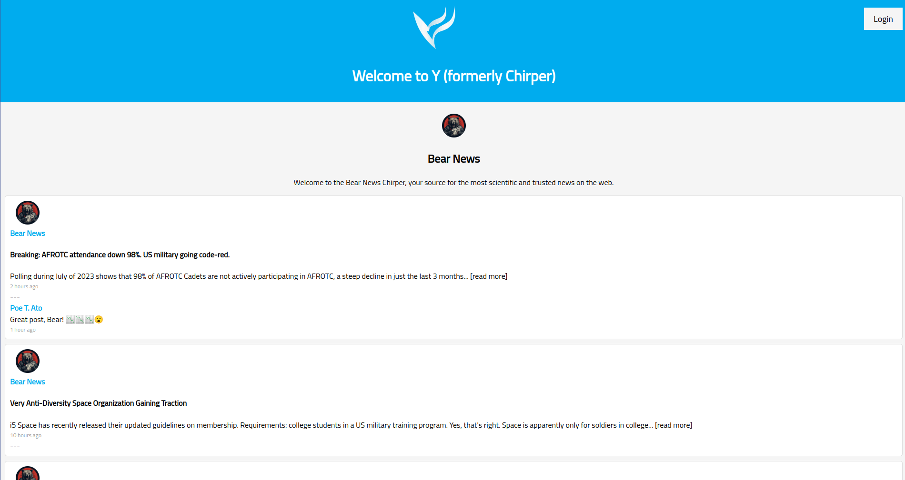

# Operation Glowing Violin

Welcome to Operation Glowing Violin, a Cyber Training Exercise (CTX) designed for i5 cadets.

Takedown a state actor by infiltrating their social media site.

### Objectives

Estimated skills (see [skill levels](https://github.com/CyberTrainingExercise/Docs/blob/master/ctx_requirements.md) for meaning)
- Programming skills required (0-3)
    - 2
- System adminitration skills required (0-3)
    - 2
- Pentesting skills required (0-3)
    - 2

Total time: 70 mins
 - 10 for preparation
 - 60 for execution

Technical Objectives:
1. Attacking Web Services
1. Cross Site Scripting (XSS)
1. Cross Site Request Forgery (CSRF)

### Requirements

If you would like to perform this CTX you will need the following:

1. An Admin who is technically skilled to setup the scenario.
    - Hopefully this guide will make it easy, but you still need technical know how to do it.
    - Required skills:
        - Docker
        - Cross Site Scripting (XSS)
        - Cross Site Request Forgery (CSRF)
        - Webservers
2. The following equipment:
    - 1 computer for running the vulnerable webserver
    - 1-3 computers for hacking

### Expected Design

TODO

### Scenario

Similar to [Operation Glowing Symphony](https://cyberlaw.ccdcoe.org/wiki/Operation_Glowing_Symphony_(2016)), but on a much smaller and more tame scale.

A foreign military force has been utilizing the website V.com to promote propoganda via their state news channel. Intel believes they hold valuable private information in their direct messages. Your mission is to obtain their login credentials and gain access to this valuable private information. Due to recent rebranding and the associated refactoring, it is believe that XSS and CSRF attacks were reintroduced into the V codebase.

State propoganda's channel on V.

### Difficulty Dials

TODO

### Docs

TODO

### Setup

TODO

### Onsite Setup

TODO

### Debrief Ideas

TODO

### Misc

TODO